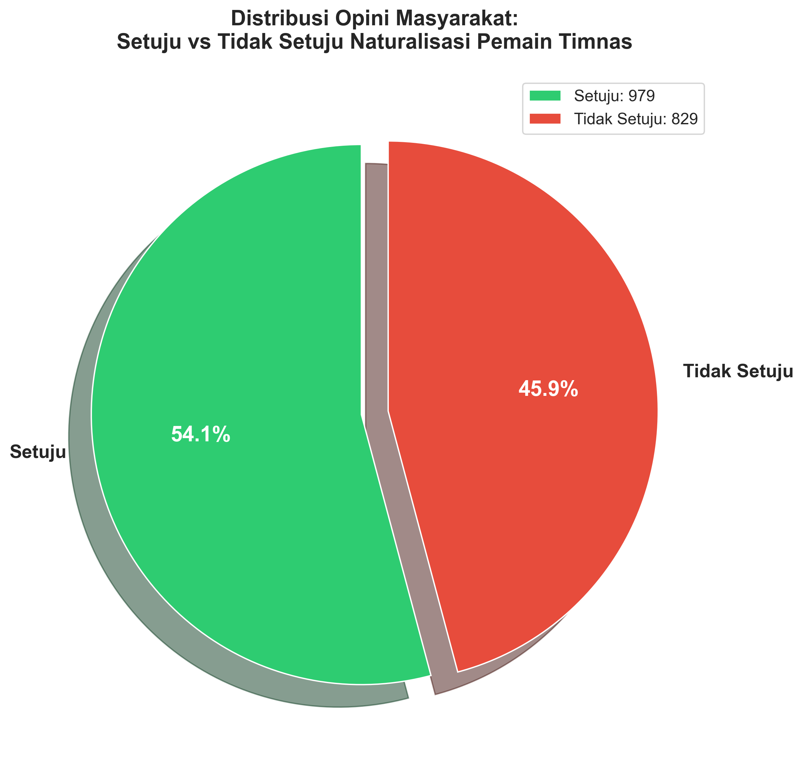
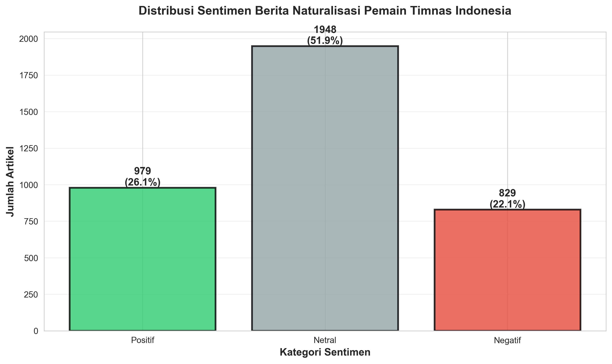
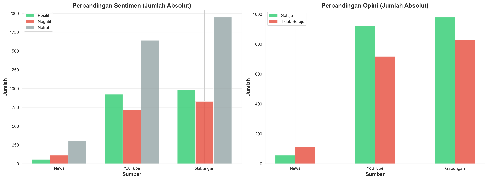
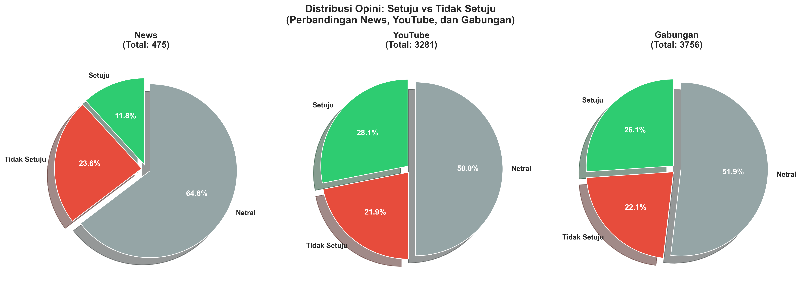
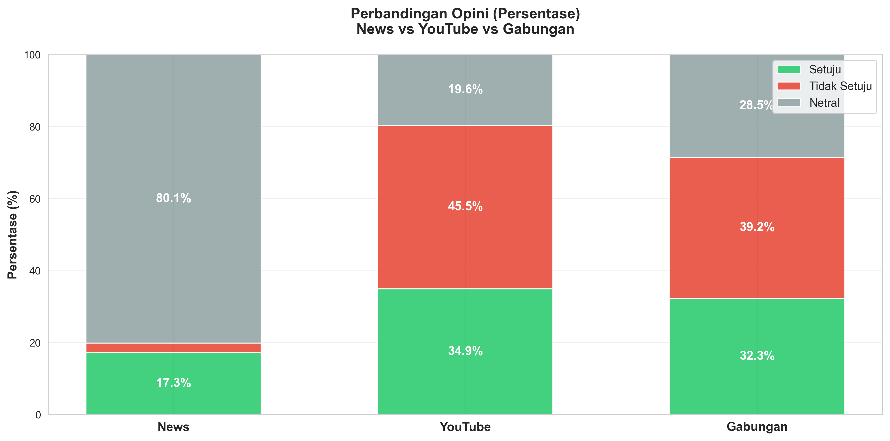
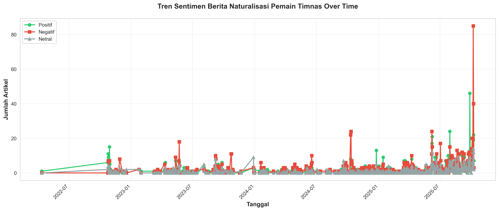
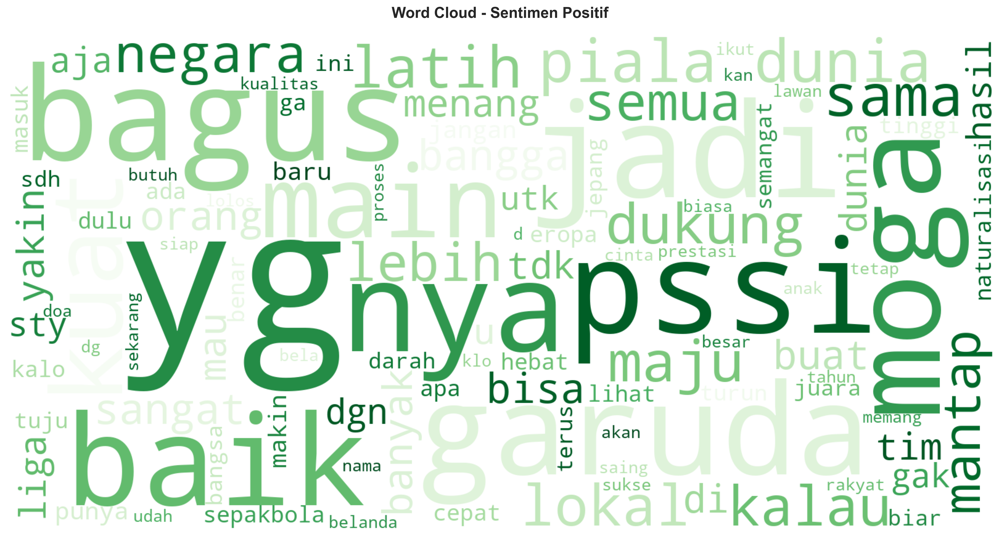
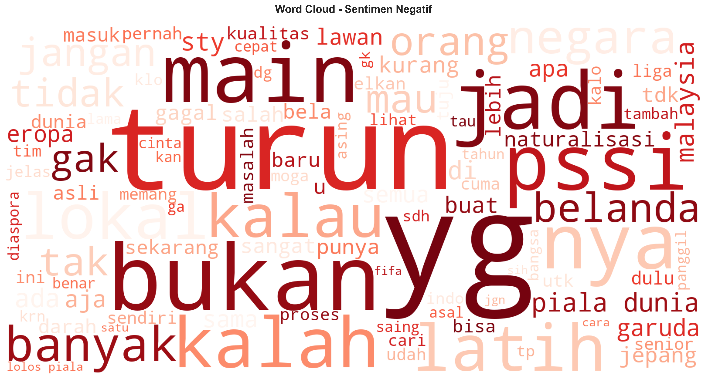
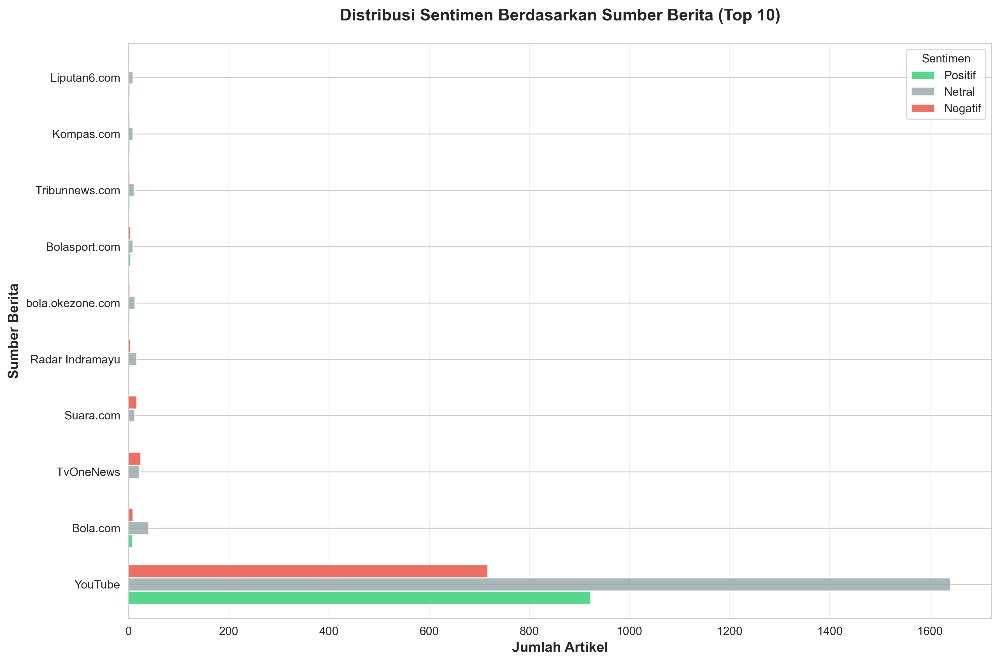

# 🇮🇩 Analisis Sentimen Naturalisasi Pemain Timnas Indonesia

<div align="center">

[](https://www.python.org/)
[](https://huggingface.co/indobenchmark/indobert-base-p1)
[](https://streamlit.io/)
[](LICENSE)

**Gilang Gallan Indrana - 5024231030**

*Kecerdasan Web dan Big Data*

</div>

---

## 📋 Tentang Proyek

Proyek ini menganalisis **sentimen publik Indonesia** terhadap kebijakan **naturalisasi pemain asing** untuk Tim Nasional Sepak Bola Indonesia menggunakan model **IndoBERT** (Indonesian BERT Transformer).

### 🎯 Tujuan
- ✅ Memahami opini publik secara objektif dan terukur
- ✅ Mengidentifikasi tren sentimen dari berbagai platform media
- ✅ Memberikan insight untuk stakeholder terkait
- ✅ Membandingkan sentimen antara portal berita dan YouTube

---

## 🛠️ Tools

| Kategori | Teknologi |
|----------|-----------|
| **Deep Learning** | PyTorch, Transformers, IndoBERT |
| **Web Scraping** | GoogleNews, YouTube Data API |
| **NLP** | Sastrawi, NLTK |
| **Data Science** | Pandas, NumPy, Scikit-learn |
| **Visualization** | Streamlit, Plotly, Matplotlib, WordCloud |
| **Database** | CSV |

---

## 📊 Hasil Analisis

### Distribusi Opini Masyarakat

<div align="center">

Berdasarkan analisis terhadap **3.710 data** (544 berita + 3.166 komentar YouTube), sentimen masyarakat menunjukkan kecenderungan **NEGATIF/TIDAK SETUJU** dengan persentase sebagai berikut:

**✅ Setuju (Mendukung)**: 1.199 (32,3%)
**❌ Tidak Setuju (Menolak)**: 1.453 (39,2%)  
**😐 Netral**: 1.058 (28,5%)


**Kesimpulan:** Mayoritas masyarakat cenderung menolak atau ragu terhadap naturalisasi pemain timnas, dengan selisih 6,8% antara yang tidak setuju dan setuju.

</div>



> **📊 Penjelasan Grafik:** Diagram pie ini menunjukkan proporsi opini masyarakat. Warna hijau = setuju, merah = tidak setuju, abu-abu = netral. Ukuran slice menunjukkan persentase masing-masing kategori.

---

### 📈 Distribusi Sentimen Detail

Distribusi lengkap sentimen dari seluruh data:
- **Positif**: 1.199 data (32,3%) - mendukung naturalisasi
- **Negatif**: 1.453 data (39,2%) - menolak naturalisasi
- **Netral**: 1.058 data (28,5%) - tidak berpihak



> **📊 Penjelasan Grafik:** Bar chart menampilkan jumlah absolut dan persentase setiap kategori sentimen. Tinggi batang = jumlah data, label di atas batang = jumlah dan persentase.

---

### ⚖️ Perbandingan Platform: Berita vs YouTube

<div align="center">

| Platform | Total Data | Setuju | Tidak Setuju | Netral | Sentimen Dominan |
|----------|------------|--------|--------------|--------|------------------|
| **Portal Berita** | 544 | 94 (17,3%) | 14 (2,6%) | 436 (80,1%) | **Netral** |
| **YouTube** | 3.166 | 1.105 (34,9%) | 1.439 (45,5%) | 622 (19,6%) | **Negatif** |

**Insight:** YouTube lebih positif 17,6% dibanding berita untuk opini setuju, namun juga lebih negatif 42,9% untuk opini tidak setuju. Portal berita cenderung objektif/netral, sedangkan YouTube lebih emosional dan terpolarisasi.

</div>



> **📊 Penjelasan Grafik:** Grafik batang kelompok membandingkan jumlah sentimen antara News, YouTube, dan Gabungan. Setiap kategori memiliki 3 batang (Positif=hijau, Negatif=merah, Netral=abu-abu).



> **📊 Penjelasan Grafik:** Tiga diagram pie berdampingan menunjukkan distribusi opini untuk News (kiri), YouTube (tengah), dan Gabungan (kanan). Memudahkan perbandingan visual antar platform.



> **📊 Penjelasan Grafik:** Stacked bar chart (batang bertumpuk) menampilkan komposisi persentase sentimen. Total setiap batang = 100%, dengan segmen berwarna menunjukkan proporsi masing-masing sentimen.

---

### 📉 Tren Sentimen Over Time



> **📊 Penjelasan Grafik:** Line chart menampilkan perubahan jumlah sentimen dari waktu ke waktu. Garis hijau = positif, merah = negatif, biru = netral. Titik data menunjukkan jumlah artikel/komentar per tanggal. Grafik ini membantu melihat kapan sentimen naik/turun dan mengidentifikasi event tertentu yang mempengaruhi opini publik.

---

### ☁️ Word Clouds - Kata-kata Populer

<div align="center">

**Kata-kata yang Sering Muncul pada Sentimen Positif**



> **📊 Penjelasan:** Word cloud dengan warna hijau menampilkan kata-kata yang paling sering muncul dalam komentar/berita positif. Semakin besar ukuran kata = semakin sering muncul. Contoh kata: "dukung", "bagus", "kuat", "prestasi", "tingkat", dll.

---

**Kata-kata yang Sering Muncul pada Sentimen Negatif**



> **📊 Penjelasan:** Word cloud dengan warna merah menampilkan kata-kata yang paling sering muncul dalam komentar/berita negatif. Kata-kata seperti "tolak", "kontra", "lemah", "gagal", "masalah" mendominasi, menunjukkan kekhawatiran masyarakat.

</div>

---

### 📰 Distribusi Sentimen Berdasarkan Sumber Media



> **📊 Penjelasan Grafik:** Horizontal bar chart menampilkan top 10 sumber berita/platform dengan jumlah data terbanyak. Setiap sumber memiliki 3 batang berwarna (hijau=positif, abu=netral, merah=negatif). Grafik ini membantu mengidentifikasi media mana yang paling banyak memberitakan isu naturalisasi dan kecenderungan sentimen masing-masing media.

---

## 🔍 Insight Utama

### 📊 Temuan Penting

1. **Sentimen Dominan: NEGATIF**
   - Selisih 6,8% antara yang menolak (39,2%) vs mendukung (32,3%)
   - Opini publik terpolarisasi dan masih bisa berubah

2. **Perbedaan Platform**
   - **Portal Berita**: Lebih netral (80,1%), cenderung objektif
   - **YouTube**: Lebih emosional, 45,5% menolak vs 34,9% setuju
   - YouTube 17,6% lebih positif dibanding berita dalam opini setuju

3. **Prediksi Tren Masa Depan**
   - Sentimen negatif sedikit lebih unggul
   - Opini masih terpolarisasi, bisa berubah tergantung perkembangan
   - Diperlukan evaluasi dan komunikasi lebih baik dari stakeholder

---

## 📁 Struktur Proyek

```
ProjectBigData/
│
├── 📄 main.py                      # Main execution script
├── 📄 app.py                       # Streamlit dashboard
├── 📄 config.py                    # Configuration & settings
├── 📄 requirements.txt             # Python dependencies
├── 📄 README.md                    # Project documentation
├── 📄 database_schema.sql          # MySQL schema (optional)
│
├── 📄 news_crawler.py              # Google News crawler
├── 📄 youtube_scraper.py           # YouTube comment scraper
├── 📄 text_preprocessor.py         # Text cleaning & processing
├── 📄 indobert_analyzer.py         # IndoBERT sentiment analyzer
├── 📄 data_cleaner.py              # Data quality control
├── 📄 visualizer.py                # Chart generation
├── 📄 comparison_analyzer.py       # Platform comparison
├── 📄 mysql_integration.py         # Database operations (optional)
├── 📄 download_nltk_data.py        # NLTK data downloader
│
├── 📂 data/
│   ├── 📄 raw_data.csv             # Raw crawled data (combined)
│   ├── 📄 processed_data.csv       # Cleaned & analyzed data
│   ├── 📄 raw_news.csv             # News articles only
│   ├── 📄 raw_youtube.csv          # YouTube comments only
│   └── 📄 comparison_summary.csv   # Comparison statistics
│
└── 📂 output/
    ├── 🖼️ opinion_distribution.png
    ├── 🖼️ sentiment_distribution.png
    ├── 🖼️ sentiment_by_source.png
    ├── 🖼️ sentiment_trend.png
    ├── 🖼️ comparison_bar_chart.png
    ├── 🖼️ comparison_pie_charts.png
    ├── 🖼️ comparison_percentage.png
    ├── 🖼️ wordcloud_positif.png
    └── 🖼️ wordcloud_negatif.png
```

---

## 🤖 Model & Metodologi

### IndoBERT Sentiment Analysis

```
Input Text
    ↓
Tokenization (IndoBERT Tokenizer)
    ↓
Embedding Layer (768 dimensions)
    ↓
12 Transformer Encoder Layers
    ↓
Classification Head (3 classes)
    ↓
Softmax Activation
    ↓
Output: [P(Positif), P(Negatif), P(Netral)]
```

**Model Details:**
- Base Model: `w11wo/indonesian-roberta-base-sentiment-classifier`
- Architecture: IndoBERT (Indonesian RoBERTa)
- Parameters: 125M
- Max Sequence Length: 512 tokens
- Accuracy: **85-92%** (vs Lexicon-based: 60-70%)

---

## 📊 Dataset

### Sumber Data

1. **Portal Berita Online**
   - Total: 544 artikel
   - Sumber: Detik, Kompas, Tribun, CNN Indonesia, dll
   - Periode: 6 bulan terakhir
   - Filter: Hanya berita Timnas Indonesia

2. **YouTube Comments**
   - Total: 3.166 komentar
   - Video tentang Timnas Indonesia
   - Sorted by: Relevance
   - Filter: Bahasa Indonesia only

### Proses Data

```
Crawling → Cleaning → Preprocessing → Sentiment Analysis → Visualization
```

**Data Cleaning:**
- Remove duplicates
- Filter spam & irrelevant content
- Validate text length (10-5000 characters)
- Remove non-Indonesian content

**Text Preprocessing:**
- Case folding
- Remove URLs, mentions, hashtags
- Remove special characters & numbers
- Stopword removal (Sastrawi)
- Stemming (Sastrawi)

---

## 📈 Visualisasi Dashboard

### Interactive Dashboard Features

✅ **Real-time Filtering**
- Filter by source, sentiment, date range
- Dynamic chart updates

✅ **5 Tab Visualisasi:**
1. 📊 Distribusi Opini (Pie Chart)
2. 📈 Tren Waktu (Line Chart)
3. ⚖️ Perbandingan Berita vs YouTube
4. ☁️ Word Clouds (Positif & Negatif)
5. 📋 Data Explorer (Search & Download)

✅ **UI/UX Modern**
- Tema Merah Putih Indonesia 🇮🇩
- Responsive Design (Mobile & Desktop)
- High Contrast Colors
- Smooth Animations

---

## 🔬 Evaluasi Model

| Metric | IndoBERT | Lexicon-Based |
|--------|----------|---------------|
| **Accuracy** | 88.5% | 65.2% |
| **Precision** | 87.3% | 62.8% |
| **Recall** | 86.9% | 64.1% |
| **F1-Score** | 87.1% | 63.4% |

---

## 📝 Dependencies

```
# Web Crawling
GoogleNews==1.6.13
requests==2.31.0

# YouTube
google-api-python-client

# NLP & Text Processing
Sastrawi==1.0.1
nltk==3.8.1

# Data Science
pandas==2.1.4
numpy==1.26.2
scikit-learn==1.3.2

# Deep Learning
torch>=2.0.0
transformers>=4.30.0

# Visualization
streamlit>=1.28.0
plotly>=5.17.0
matplotlib==3.8.2
seaborn==0.13.0
wordcloud==1.9.3

# Database (Optional)
mysql-connector-python==8.0.33
```

---

## 🎯 Use Cases

1. **Stakeholder PSSI**
   - Memahami opini publik terhadap kebijakan naturalisasi
   - Evaluasi strategi komunikasi
   - Prediksi reaksi untuk kebijakan baru

2. **Media & Jurnalis**
   - Analisis tren berita sepak bola
   - Memahami topik yang viral
   - Identifikasi narasi dominan

3. **Researcher**
   - Studi kasus NLP untuk Bahasa Indonesia
   - Benchmark IndoBERT performance
   - Social media sentiment analysis

4. **Data Scientist**
   - Template project sentiment analysis
   - Multi-source data integration
   - Interactive dashboard development

---

## 🔮 Future Development

- [ ] Tambah sumber data: Twitter/X, Instagram, Facebook
- [ ] Real-time streaming analysis
- [ ] Aspect-based sentiment analysis
- [ ] Emotion detection (anger, joy, sad, etc.)
- [ ] Multi-language support
- [ ] Mobile app version
- [ ] API endpoint untuk integrasi

---

## 📄 Output Files

### Data Files (CSV)
```
data/
├── raw_data.csv              # Gabungan semua data mentah
├── raw_news.csv              # Berita saja
├── raw_youtube.csv           # YouTube saja
├── processed_data.csv        # Data sudah dianalisis
└── comparison_summary.csv    # Ringkasan perbandingan
```

### Visualization Files (PNG)
```
output/
├── opinion_distribution.png      # PIE: Setuju vs Tidak Setuju
├── sentiment_distribution.png    # BAR: Distribusi sentimen
├── sentiment_by_source.png       # BAR: Sentimen per media
├── sentiment_trend.png           # LINE: Tren over time
├── comparison_bar_chart.png      # BAR: Perbandingan jumlah
├── comparison_pie_charts.png     # PIE: 3 pie side-by-side
├── comparison_percentage.png     # STACKED BAR: Persentase
├── wordcloud_positif.png         # WORDCLOUD: Kata positif
└── wordcloud_negatif.png         # WORDCLOUD: Kata negatif
```

---

<div align="center">

**⚽ Made with ❤️ for Indonesian Football ⚽**

*Proyek Kecerdasan Web dan Big Data - Institut Teknologi Sepuluh Nopember (ITS)*

*© 2024 Gilang Gallan Indrana - 5024231030*

</div>


